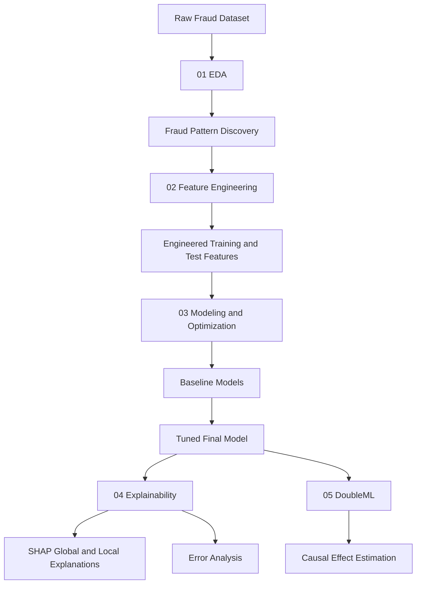
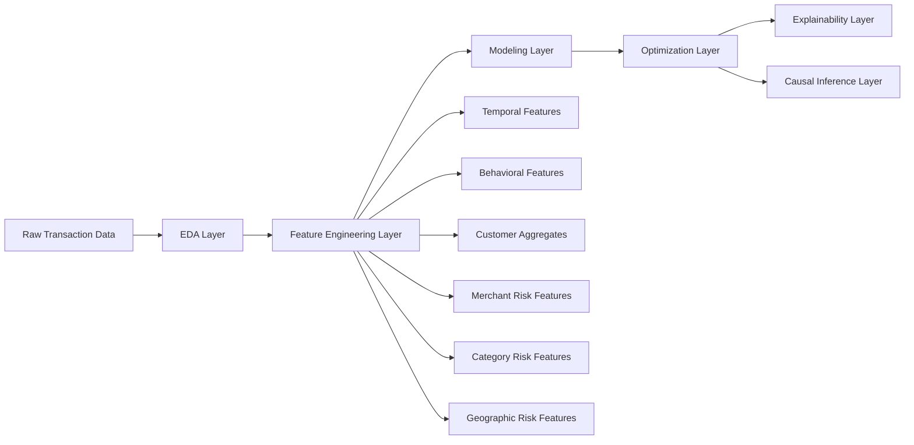
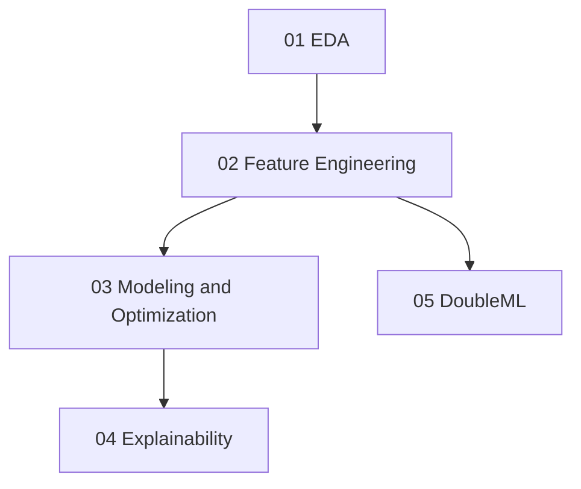
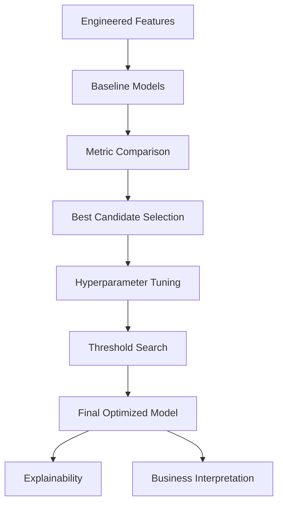
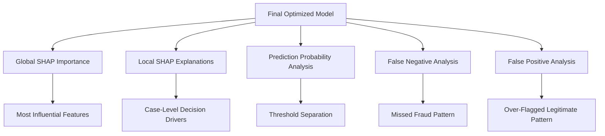
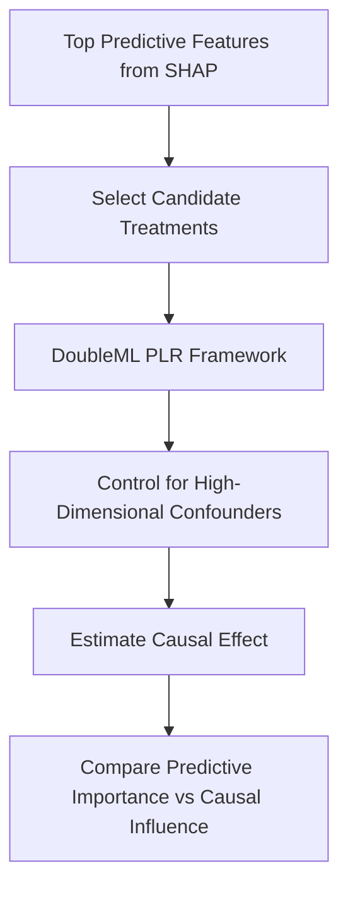

<div align="center">

# Credit Card Fraud Detection

A full end-to-end fraud analytics and machine learning project built entirely in notebooks, covering exploratory data analysis, feature engineering, predictive modeling, explainability, and causal inference.

<p align="center">
  
  
  
  
</p>

<p align="center">
  
  
  
</p>

<p align="center">
  
  
  
  
  
</p>

<p align="center">
  
  
  
</p>

</div>

---

## Overview

This repository presents a notebook-based fraud detection pipeline built on a large credit card transaction dataset. The project was designed to move beyond basic classification and develop a more complete analytics workflow that answers five major questions:

1. What patterns define fraudulent behavior in the raw data?
2. Which engineered features improve fraud detection most?
3. Which predictive models perform best on an imbalanced classification problem?
4. Why does the final model make the decisions it makes?
5. Which important variables are merely predictive, and which show evidence of causal influence?

The project is intentionally organized as a sequence of notebooks so that each stage is transparent, reproducible, and easy to review.

---

## Project Objectives

- Perform high-quality exploratory data analysis on fraud transactions
- Build strong fraud-relevant engineered features
- Train and compare multiple machine learning models
- Optimize the best model for precision-recall trade-offs
- Explain predictions globally and locally using SHAP
- Extend the project beyond prediction into causal analysis with Double Machine Learning

---

## Notebook Pipeline

**1. `01_eda.ipynb`**
Exploratory data analysis focused on understanding transaction behavior, class imbalance, temporal risk patterns, geographic fraud concentration, category-level behavior, demographic trends, and core fraud signals.

**2. `02_feature_engineering.ipynb`**
Feature engineering notebook that transforms raw transactional data into a richer modeling dataset, including behavioral, temporal, customer-level, merchant-level, location-level, and category-based risk features.

**3. `03_modeling_and_optimization.ipynb`**
Model development notebook where baseline models are trained, tuned, evaluated, compared, and optimized for the fraud detection objective.

**4. `04_explainability.ipynb`**
Explainability notebook that uses SHAP and error analysis to understand global feature importance, local decision patterns, false positives, false negatives, and probability behavior around the final threshold.

**5. `05_doubleML.ipynb`**
Causal analysis notebook that applies Double Machine Learning to estimate the causal impact of selected high-value fraud-related features.

---

## Repository Structure

```text
Credit-Card-Fraud-Detection/
│
├── 01_eda.ipynb
├── 02_feature_engineering.ipynb
├── 03_modeling_and_optimization.ipynb
├── 04_explainability.ipynb
├── 05_doubleML.ipynb
├── requirements.txt
└── README.md
```
---

## End-to-End Workflow


---

## System Architecture



---

## Notebook Dependency Map



---

## Core Methods Used

**1. Exploratory Data Analysis**

- Class balance analysis
- Distribution analysis
- Log-transformed amount analysis
- Temporal fraud profiling
- State and city concentration analysis
- Category and gender comparisons
- Geographic plotting
- Correlation analysis

**2. Feature Engineering**

- Transaction amount transformations
- High-value transaction flags
- Customer historical aggregates
- Same-day transaction behavior
- Merchant risk statistics
- Category-level fraud context
- Geographic risk summaries
- Night transaction behavior
- Age band and population band indicators

**3. Predictive Modeling**

- Logistic Regression
- Random Forest
- XGBoost

**4. Model Optimization**

- Hyperparameter tuning
- Threshold optimization
- Precision-recall trade-off analysis
- Final model comparison

**5. Explainability**

- Global feature importance
- SHAP summary plots
- SHAP dependence analysis
- High-risk and low-risk local case analysis
- False positive and false negative profiling

**6. Causal Analysis**

- Double Machine Learning
- Partially Linear Regression framework
- Multiple feature causal effect estimation

---

## Key Project Highlights

* Handles an extreme class imbalance problem in a principled way
* Uses fraud-sensitive metrics such as Precision, Recall, F1-score, ROC-AUC, and PR-AUC
* Moves from descriptive analysis to predictive modeling to causal interpretation
* Demonstrates both model performance and model transparency
* Includes threshold tuning instead of relying on default classification cutoffs
* Distinguishes between predictive importance and causal relevance

---

## Recommended Reading Order

For the clearest understanding of the project, review the notebooks in this order:

- ```01_eda.ipynb```
- ```02_feature_engineering.ipynb```
- ```03_modeling_and_optimization.ipynb```
- ```04_explainability.ipynb```
- ```05_doubleML.ipynb```

---

## Example Analytical Questions Answered
* Which transaction patterns are most associated with fraud?
* How does fraud risk vary across hours, days, and months?
* Which states, cities, and categories are most exposed?
* Which engineered features matter most for model performance?
* Which model offers the strongest precision-recall balance?
* What kinds of transactions become false positives and false negatives?
* Which top predictive drivers also show evidence of causal importance?

---
## Technical Themes Demonstrated

* Large-scale tabular fraud analytics
* Imbalanced binary classification
* Feature engineering for behavioral risk
* Interpretable machine learning
* Threshold optimization
* Error analysis
* Causal machine learning

---

## Modeling Decision Pipeline



---

## Explainability Logic


---

## Causal Inference Logic


---

## Project Deliverables
- A structured five-notebook fraud pipeline
- Engineered modeling datasets
- Baseline and optimized classification models
- Explainability analysis of the final model
- Causal effect estimates for selected fraud drivers

---

## Future Improvements

* Sequence modeling for transaction history
* Graph-based fraud detection
* Real-time scoring simulation
* Calibration diagnostics
* Drift monitoring across time periods
* Advanced uplift or treatment heterogeneity analysis

---

## Author

**Nomusa Shongwe**
Data Science | Machine Learning | Fraud Analytics | Explainable AI | Causal Inference

---

## License
This project is released under the MIT License.
